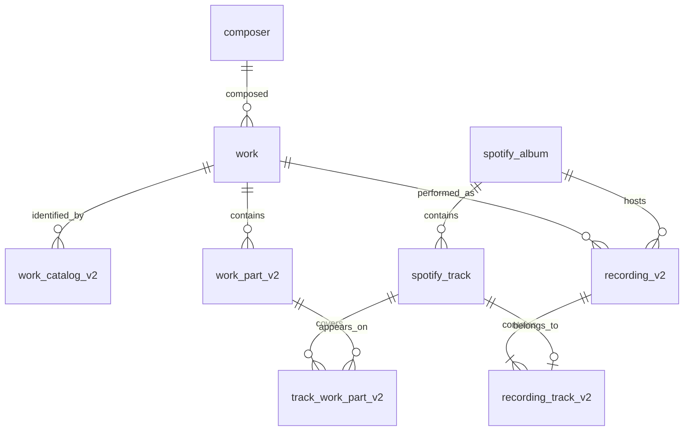
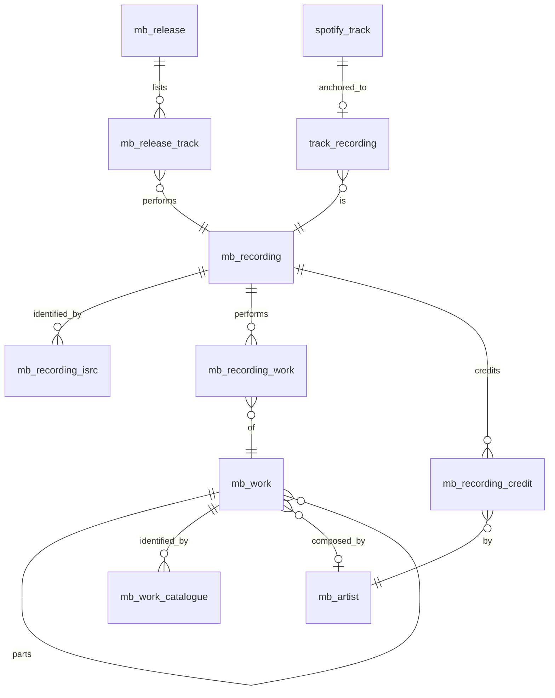

# Classical metadata data model

## Design principles

- Spotify owns albums, tracks, artists, durations, and physical album order.
- Prelude owns the classical interpretation: composer, work, catalog identifiers, work parts, recordings, and track-to-part assignments.
- A work part is a flat canonical leaf. There is no parent/submovement tree.
- A recording is a particular performance of one work on one Spotify album, identified by explicit track membership rather than an occurrence number.
- The model supports both one track containing several work parts and one work part spanning several tracks.

The `_v2` suffix is historical. `work_catalog_v2`, `work_part_v2`,
`recording_v2`, `recording_track_v2`, and `track_work_part_v2` are the live
production model. The v1 tables they replaced — `movement`, `recording`,
`track_movement` — are gone; the schema declared them for a while after
production had dropped them, which is why `spotify-utils.ts` still speaks of
"track movements" while querying `track_work_part_v2`.

## Core entities

### Spotify source entities

`spotify_album`, `spotify_track`, `spotify_artist`, and `track_artists` cache the Spotify data needed by the application. `spotify_track` persists both `disc_number` and `track_number`.

Album and recording track order is always `(disc_number, track_number)`. Duplicate `track_number` values across discs are expected and are not ambiguous.

### `composer`

Stores the canonical composer identity and, when known, the corresponding Spotify artist ID. A composer can own many works.

Composer matching first uses normalized full names, then a unique surname match. Ambiguous surnames do not resolve automatically.

### `work`

Represents a complete musical work, not a movement, album heading, collection, or arbitrary excerpt. Examples are “Symphony No. 9 in D minor” and “The Nutcracker.”

`catalog_system` and `catalog_number` remain on `work` as a primary/display-compatible identifier, but catalog lookup and multi-identifier support belong to `work_catalog_v2`.

Work identity is determined from:

1. composer identity;
2. normalized catalog system and number when present;
3. normalized complete-work title;
4. an existing compatible assignment when reparsing a known track; and
5. recorded migration decisions for merged work IDs.

A catalog number alone is not proof of equality. Collections, constituent works, excerpts, and arrangements can share a collection-level identifier.

### `work_catalog_v2`

Stores one or more catalog identifiers for a work:

- `system` and `number` preserve display values;
- `normalized_system` removes punctuation, whitespace, case, and diacritic differences used for lookup;
- `normalized_number` removes whitespace, case, and diacritic differences used for lookup; and
- `is_primary` marks the preferred identifier.

For example, `Op`, `Op.`, and case variants normalize to the same system. Display strings must not be reconstructed from normalized values.

Multiple works may share a normalized identifier when the source identifier describes a collection. The unique constraint is per work and normalized identifier, not globally across all works.

### `work_part_v2`

Represents a canonical leaf part of a work with:

- `position`: stable flattened order within the work;
- `label`: printed identifier only, such as `III`, `III.2`, `Act I: No. 2`, or `Variation 18`; and
- `title`: descriptive text only, such as `Tuba mirum` or `Menuetto. Allegro molto`.

`label` and `title` are separate because the label is structural identity while the title is descriptive metadata. The UI displays stored `label + title` exactly once; it must not generate another Roman numeral when a label exists.

`position` is not a Spotify track number and is never sufficient to establish equality. It exists to provide stable canonical ordering of the known leaf parts and is unique within a work. It may contain gaps when only part of a work is represented in the catalog.

Work parts are flat. A hierarchical label such as `III.2` preserves source structure without introducing parent rows.

Part resolution currently considers, in order:

1. exact normalized label and title;
2. a unique normalized label, allowing Spotify title variants for the same printed movement;
3. a unique normalized title;
4. the track’s previous part when its label or title remains compatible; and
5. the requested position only when the existing occupant has a matching label or compatible title.

If a requested position is occupied by a contradictory part, a new free position is allocated and the assignment is marked `needs_review`. Position alone never overwrites an existing part.

### `track_work_part_v2`

This is the many-to-many link between Spotify tracks and work parts. It supports:

- a combined track linked to multiple parts;
- a part linked to multiple tracks when a movement is split;
- optional `start_ms` and `end_ms` boundaries for future partial-track segmentation;
- `match_source`: `parser`, `migrated`, or `manual`; and
- `match_status`: `confirmed` or `needs_review`.

Every linked part must belong to the same work as the track’s recording.

### `recording_v2` and `recording_track_v2`

A recording belongs to one work and one Spotify album. Multiple recordings of the same work may exist on the same album; this is necessary for compilations containing several performances.

`recording_track_v2` explicitly declares membership. In the current v1 constraint, a Spotify track belongs to at most one recording. Recording order is derived from the first member track in Spotify `(disc_number, track_number)` order. There is no stored occurrence number.

Recording identity on a rerun is reconciled by:

1. exact track-set equality;
2. otherwise, a unique greatest membership overlap for the same album and work; or
3. a new recording if neither rule yields an unambiguous match.

### Where MusicBrainz lives

What MusicBrainz says is held in the `mb_*` cache described below, keyed by
MBID, and never merged into the columns the app reads. That separation is the
point: where our own column is empty the cache holds a gap we can close, and
where the two differ it is a disagreement — and the two cases have to stay
distinguishable.

Identity lives on the entities themselves — `composer.musicbrainz_id`,
`work.musicbrainz_id`, `work_part_v2.musicbrainz_id` — because that is a fact
about which row this _is_, not a claim about its contents.
`spotify_track.isrc` and `track_recording` carry the join: Spotify reports the
ISRC, MusicBrainz resolves it to a recording, and the recording's
`performance` relationship reaches the work.

`work_catalog_v2.source` distinguishes parser-derived catalogue references
from imported ones. MusicBrainz carries alternates our parser never sees —
Chopin's B. and C. numbers, Scarlatti's Longo, the Fanna numbers for Vivaldi —
and a reader searching by one of those needs to find the work. Imported rows
are never `is_primary`, so nothing on a card changes; they widen lookup only.

There was a `musicbrainz_fact` table doing this job before the cache existed:
a key-value row per entity and field, filled by a backfill that walked works
one at a time. Every one of its fields — parent work, work type, work title,
part title, composer dates — is a column in the cache now, and the cache
reaches further, so the table was dropped rather than maintained beside its
replacement.

### `metadata_migration_audit`

Records deterministic merge, keep, and removal decisions. Resolvers use work merge mappings so known historical IDs point at their canonical target. Material manual repairs should include a concise reason.

### `match_queue`

Stores ingestion state per Spotify track. Valid states are:

- `pending`: available to claim;
- `processing`: leased to one worker;
- `matched`: has usable classical metadata;
- `failed`: terminal or retryable failure, depending on attempts and error;
- `not_classical`: terminal classification and intentionally allowed to remain unlinked.

The physical column `workflow_run_id` is exposed in code as `claimOwnerId`; it now stores the worker lease owner rather than a GitHub Actions run.

### `mb_request_budget` and `mb_gateway_control`

MusicBrainz request accounting and the kill switch, described in
`docs/metadata-pipeline.md`. `mb_request_budget` counts requests per UTC day
and channel; `mb_gateway_control` holds pause flags and cap overrides, keyed by
channel or by the pseudo-channel `all`.

Neither is metadata. They are here because the budget is the constraint the
metadata pipeline is designed around: how much of MusicBrainz we can read in a
day decides how much of the catalogue MusicBrainz gets to describe.

## The MusicBrainz cache

A second set of tables holds MusicBrainz as MusicBrainz states it, keyed by
MBID and shared by every user. They are a cache of somebody else's database,
not our interpretation of it: nothing in them is edited by hand, and anything
we believe that MusicBrainz does not is recorded elsewhere.

They exist alongside the model above rather than replacing it. Nothing the
reader shows comes from here yet except recording credits.

### `mb_work`

The recursive tree our own model does not have. `parent_mbid` and
`ordering_key` come from the child's own view of the `parts` relationship, so
a child fetch answers both what it belongs to and where it sits, and the
parent never has to be read to learn the order of its parts.

`detail` separates a work we have fetched (`full`) from one we only know the
name of because a recording pointed at it (`stub`). A release read names
dozens of works and gives the parent of none of them, so without this the
cache could not tell "no parent" from "not looked at yet". The stub rows are
also the backfill queue.

Which node of the tree is the work a reader sees is decided by
`workLevelOf` (`app/lib/musicbrainz-work-level.ts`), not stored.

### `mb_recording`, `mb_recording_isrc`, `mb_recording_work`, `mb_recording_credit`

A recording is one performance, independent of the releases carrying it —
the relationship our `recording_v2` gets the wrong way round by tying a
performance to a Spotify album.

`mb_recording_isrc` is not keyed on the ISRC alone. An ISRC should identify
one recording, and MusicBrainz genuinely holds cases where a label attached
the same one to two; a unique key would hide the conflict rather than let us
find and report it.

`mb_recording_credit` holds the role MusicBrainz states — `conductor`,
`performing orchestra`, `instrument` with the instrument as an attribute.
`instrument` is `''` rather than null where a role has none, because it is
part of the key and SQLite allows duplicate rows when a key column is null.

### `mb_artist`

`credited_name` is the name a release printed. MusicBrainz files an artist
under their own script, so a conductor is stored as 鈴木雅明 where the rest of
this interface is Latin, and the release's artist credit carries the Latin
form at no extra request. `sort_name`, `type` and the years cost a lookup
each and are filled in by a sweep, composers first.

### `mb_release` and `mb_release_track`

An exact tracklist, replacing the parser's album-local `recordingGroup`
string and the token-overlap threshold used to reconcile it.

### `track_recording`

The join between Spotify and MusicBrainz: which recording a track is.
`matched_by` records how, because the routes do not deserve equal trust — an
ISRC is the label's own identifier, while a position on a release is only as
good as the release match behind it.

Anchoring by position asks whether the album's whole tracklist lines up with
the release's, not whether one track does. A CD master and its Spotify
transfer routinely differ by seconds, and deciding per track leaves an album
anchored in patches, where the gaps read as missing data rather than as doubt
about the tracklist. A track held in isolation — one liked track from a box
set — has no tracklist behind it and is held to a tighter tolerance.

### `mb_submission`

Every edit sent to MusicBrainz, whoever sent it. A human clicking through a
prefilled form and a bot posting the same edit are recorded identically, so
that when a class of edit earns automation nothing downstream changes with
it. It is also the cross-user deduplicator: two people owning the same album
must not both submit its ISRCs.

`outcome` stays `pending` until MusicBrainz shows the edit landed. Recheck
fetches the submitted entities into `mb_*` and then marks applied when those
tables hold the fact. Confirming without a fetch would record our intention
rather than the result.

### `mb_invariant_result`

The latest result of each cache invariant, so admin can show the current
state as a page rather than behind a command. Defined in
`app/lib/musicbrainz-invariants.ts` and run from three places: the cheap ones
in the worker after each album, all of them from the CLI.

### `work.parser_form` and `work_part_v2.parser_title`

What the LLM parser said, where MusicBrainz has since replaced it.

`work.form` and `work_part_v2.title` were both written by the parser reading
a Spotify track title. Presenting a difference with MusicBrainz as a decision
for a person treated a guess as evidence, so MusicBrainz owns both now. The
parser's reading is kept rather than deleted: it is often the more specific
of the two — "violin concerto" where MusicBrainz says "concerto" — and that
is worth having for recommendation and grouping, which do not have to be
right.

MusicBrainz does not get to shorten a movement title, and a value still
carrying a catalogue reference is a work title rather than a movement title.
Both are refused.

`work.form` is empty where MusicBrainz has no type for the work. That is a
gap, counted by `metadata:validate`, not a failure.
