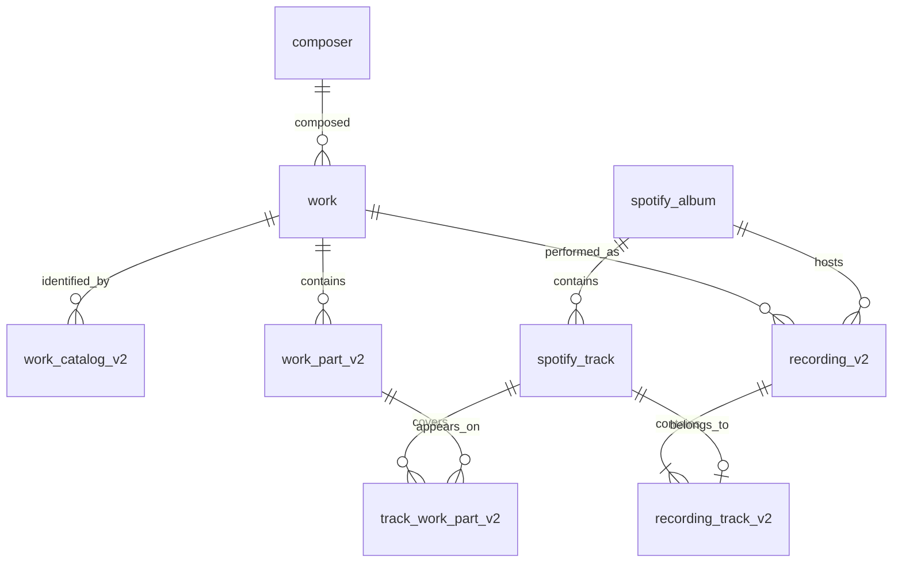

# Classical metadata data model

## Design principles

- Spotify owns albums, tracks, artists, durations, and physical album order.
- Prelude owns the classical interpretation: composer, work, catalog identifiers, work parts, recordings, and track-to-part assignments.
- A work part is a flat canonical leaf. There is no parent/submovement tree.
- A recording is a particular performance of one work on one Spotify album, identified by explicit track membership rather than an occurrence number.
- The model supports both one track containing several work parts and one work part spanning several tracks.

The `_v2` suffix is historical. `work_catalog_v2`, `work_part_v2`, `recording_v2`, `recording_track_v2`, and `track_work_part_v2` are the live production model.

## Core entities

### Spotify source entities

`spotify_album`, `spotify_track`, `spotify_artist`, and `track_artists` cache the Spotify data needed by the application. `spotify_track` persists both `disc_number` and `track_number`.

Album and recording track order is always `(disc_number, track_number)`. Duplicate `track_number` values across discs are expected and are not ambiguous.

### `composer`

Stores the canonical composer identity and, when known, the corresponding Spotify artist ID. A composer can own many works.

Composer matching first uses normalized full names, then a unique surname match. Ambiguous surnames do not resolve automatically.

### `work`

Represents a complete musical work, not a movement, album heading, collection, or arbitrary excerpt. Examples are “Symphony No. 9 in D minor” and “The Nutcracker.”

`catalog_system` and `catalog_number` remain on `work` as a primary/display-compatible identifier, but catalog lookup and multi-identifier support belong to `work_catalog_v2`.

Work identity is determined from:

1. composer identity;
2. normalized catalog system and number when present;
3. normalized complete-work title;
4. an existing compatible assignment when reparsing a known track; and
5. recorded migration decisions for merged work IDs.

A catalog number alone is not proof of equality. Collections, constituent works, excerpts, and arrangements can share a collection-level identifier.

### `work_catalog_v2`

Stores one or more catalog identifiers for a work:

- `system` and `number` preserve display values;
- `normalized_system` removes punctuation, whitespace, case, and diacritic differences used for lookup;
- `normalized_number` removes whitespace, case, and diacritic differences used for lookup; and
- `is_primary` marks the preferred identifier.

For example, `Op`, `Op.`, and case variants normalize to the same system. Display strings must not be reconstructed from normalized values.

Multiple works may share a normalized identifier when the source identifier describes a collection. The unique constraint is per work and normalized identifier, not globally across all works.

### `work_part_v2`

Represents a canonical leaf part of a work with:

- `position`: stable flattened order within the work;
- `label`: printed identifier only, such as `III`, `III.2`, `Act I: No. 2`, or `Variation 18`; and
- `title`: descriptive text only, such as `Tuba mirum` or `Menuetto. Allegro molto`.

`label` and `title` are separate because the label is structural identity while the title is descriptive metadata. The UI displays stored `label + title` exactly once; it must not generate another Roman numeral when a label exists.

`position` is not a Spotify track number and is never sufficient to establish equality. It exists to provide stable canonical ordering of the known leaf parts and is unique within a work. It may contain gaps when only part of a work is represented in the catalog.

Work parts are flat. A hierarchical label such as `III.2` preserves source structure without introducing parent rows.

Part resolution currently considers, in order:

1. exact normalized label and title;
2. a unique normalized label, allowing Spotify title variants for the same printed movement;
3. a unique normalized title;
4. the track’s previous part when its label or title remains compatible; and
5. the requested position only when the existing occupant has a matching label or compatible title.

If a requested position is occupied by a contradictory part, a new free position is allocated and the assignment is marked `needs_review`. Position alone never overwrites an existing part.

### `track_work_part_v2`

This is the many-to-many link between Spotify tracks and work parts. It supports:

- a combined track linked to multiple parts;
- a part linked to multiple tracks when a movement is split;
- optional `start_ms` and `end_ms` boundaries for future partial-track segmentation;
- `match_source`: `parser`, `migrated`, or `manual`; and
- `match_status`: `confirmed` or `needs_review`.

Every linked part must belong to the same work as the track’s recording.

### `recording_v2` and `recording_track_v2`

A recording belongs to one work and one Spotify album. Multiple recordings of the same work may exist on the same album; this is necessary for compilations containing several performances.

`recording_track_v2` explicitly declares membership. In the current v1 constraint, a Spotify track belongs to at most one recording. Recording order is derived from the first member track in Spotify `(disc_number, track_number)` order. There is no stored occurrence number.

Recording identity on a rerun is reconciled by:

1. exact track-set equality;
2. otherwise, a unique greatest membership overlap for the same album and work; or
3. a new recording if neither rule yields an unambiguous match.

### `musicbrainz_fact`

What MusicBrainz asserts about an entity we have already matched to it:
`(entity_type, entity_id, field) -> value`, plus the MusicBrainz entity the
value was read from.

It is deliberately _not_ merged into the columns the app reads. A value here is
a second opinion, and keeping it separate preserves the only distinction that
matters when importing: where our own column is empty the fact is a gap we can
close, and where the two differ it is a disagreement for a person to settle.
Writing MusicBrainz straight into `work.form` or `work_part_v2.title` would make
those two cases indistinguishable after the fact.

Identity lives on the entities themselves — `composer.musicbrainz_id`,
`work.musicbrainz_id`, `work_part_v2.musicbrainz_id` — because that is a fact
about which row this _is_, not a claim about its contents. `spotify_track.isrc`
and `spotify_track.mb_recording_id` carry the join: Spotify reports the ISRC,
MusicBrainz resolves it to a recording, and the recording's `performance`
relationship reaches the work.

`work_catalog_v2.source` distinguishes parser-derived catalogue references from
imported ones. MusicBrainz carries alternates our parser never sees — Chopin's
B. and C. numbers, Scarlatti's Longo, the revised Köchel — and a reader
searching by one of those needs to find the work. Imported rows are never
`is_primary`, so nothing in the UI changes; they only widen lookup.

### `metadata_migration_audit`

Records deterministic merge, keep, and removal decisions. Resolvers use work merge mappings so known historical IDs point at their canonical target. Material manual repairs should include a concise reason.

### `match_queue`

Stores ingestion state per Spotify track. Valid states are:

- `pending`: available to claim;
- `processing`: leased to one worker;
- `matched`: has usable classical metadata;
- `failed`: terminal or retryable failure, depending on attempts and error;
- `not_classical`: terminal classification and intentionally allowed to remain unlinked.

The physical column `workflow_run_id` is exposed in code as `claimOwnerId`; it now stores the worker lease owner rather than a GitHub Actions run.
